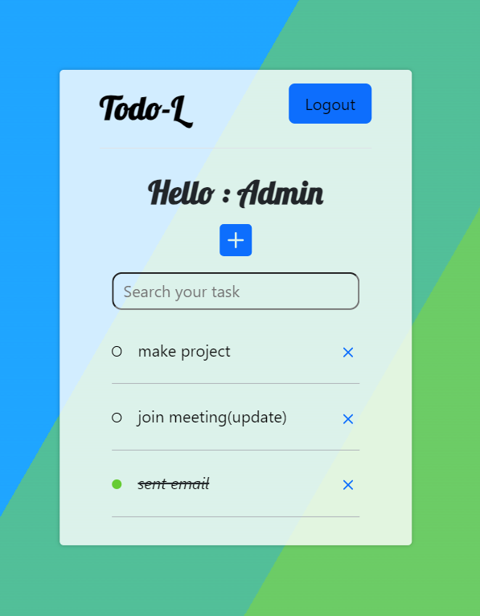

## Todo List
### Description
This is a simple Todo application built off Django (including the Django REST Framework for API CRUD operations).

### Features
The Todo_List Django Web App offers the following features:
- **Task Management**: Easily add, edit, and delete tasks.
- **Task Categorization**: Divide tasks in different categories.
- **User Authentication**: Secure account management (signin,signup,forgot password).
- **Profile Managemet**: View/Change user details

### Technologies Used
- **Frontend**: HTML , css , JavaScript , Bootstrap
- **Backend**: Django
- **Database**: SQLite

